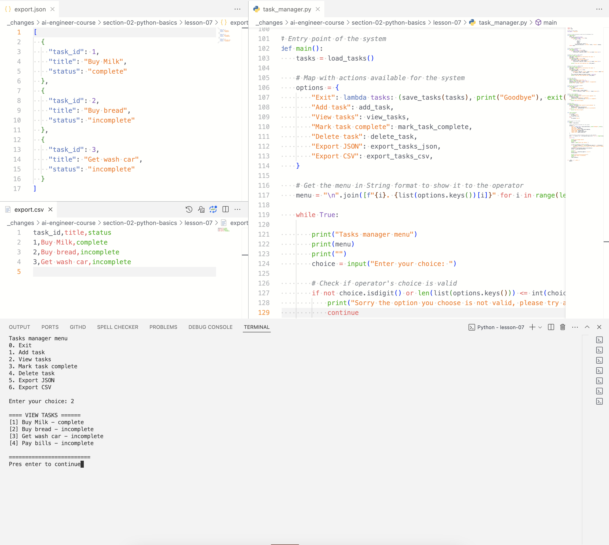

# Python basics Task manager assignment

## Lessons
2. Programming basics
3. Development setup
4. Control flow
5. Functions and modules
6. Data structures 
  . Lists
  . Tuples
  . Sets
7. Working with strings
8. File handling 
9. Pythonic code and project ( Tasks manager)